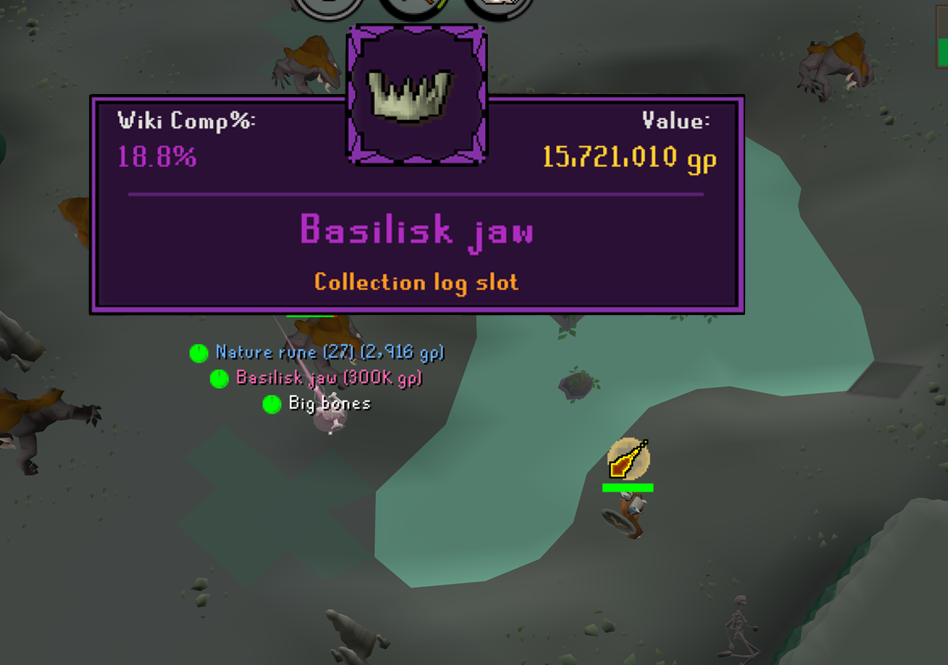
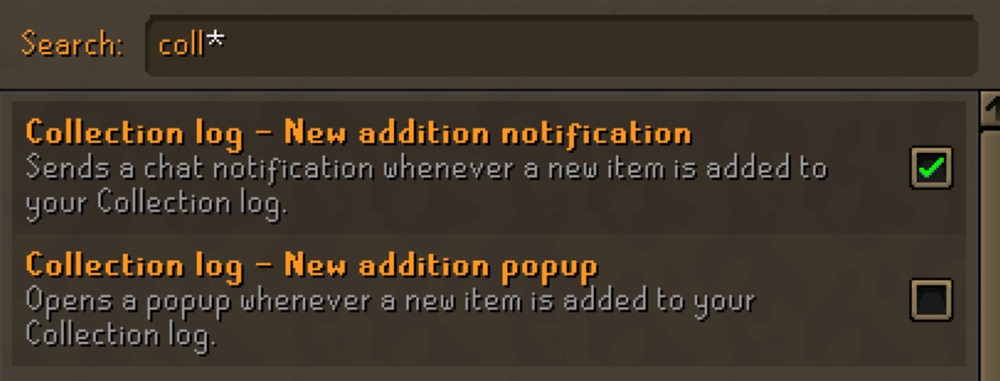

# Collection Log Popup Enhanced
Displays a popup and sound effect based on rarity on new collection logs

# Setup
In settings menu, 
1: enable 'Collection log - New addition notification'
2: disable 'Collection log - New addition popup' (so you don't get duplicate popups)

# Testing
If you'd like to test the visuals of the plugin you can do so with:
::clogtest X
E.G '::clogtest 5' would show 5 random unlocks in a row
OR
::clogtest NAME
E.G '::clogtest basilisk' jaw would show that specific item.

Note: This doesn't actually unlock the clog ;) It's just for testing.

# Popup
The popup will apear on gaining a new collection log slot, and show the icon for the item.
It also shows a different frame and sound effect based the completion rate of the item and the value (can be configured in settings to be either of the two or a combination)
At the top of the panel two values are displayed (configurable in setting). These values are:
- KC at which you got the item 
-- if no KC is available, it falls back to showing comp%
- Completion 
-- based on how many other players have this item (https://oldschool.runescape.wiki/w/Collection_log/Table)
- Drop rate
-- Shows drop rate of the item if available. Falls back to value if not.
- Value of the item
-- Based on G.E or High alch.

# Thanks to:
C engineer plugin for collection log slot popup tie ins
Trailblazer audio effect for references to scripts on playing audio

The popup backgrounds are from:
https://bdragon1727.itch.io/custom-border-and-panels-menu-all-part
and customized by me in photoshop.

Sound effects (feel free to change them to your own files):
Common: https://freesound.org/people/Kenneth_Cooney/sounds/609336/
Uncommon: https://freesound.org/people/PearceWilsonKing/sounds/238855/
Rare: https://freesound.org/people/jobro/sounds/198808/
Very rare: https://freesound.org/people/_MC5_/sounds/524848/
Pet: https://freesound.org/people/Tuudurt/sounds/275104/