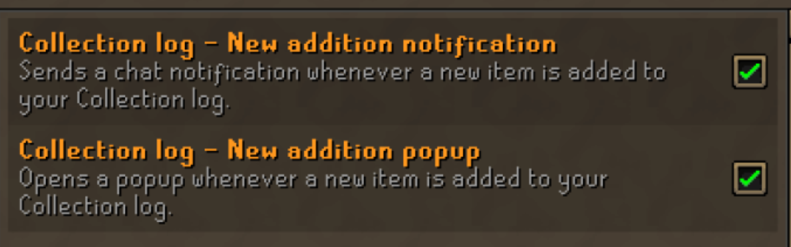
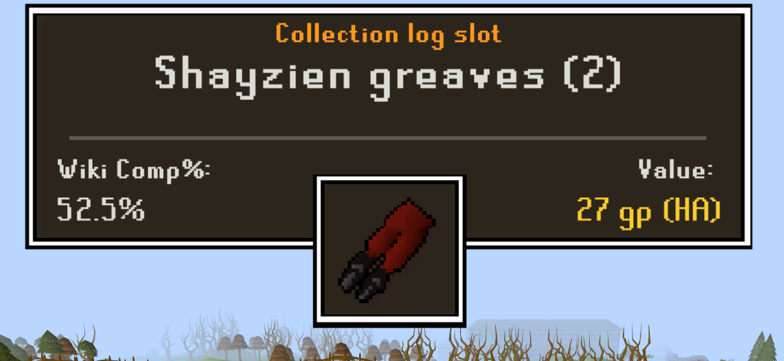
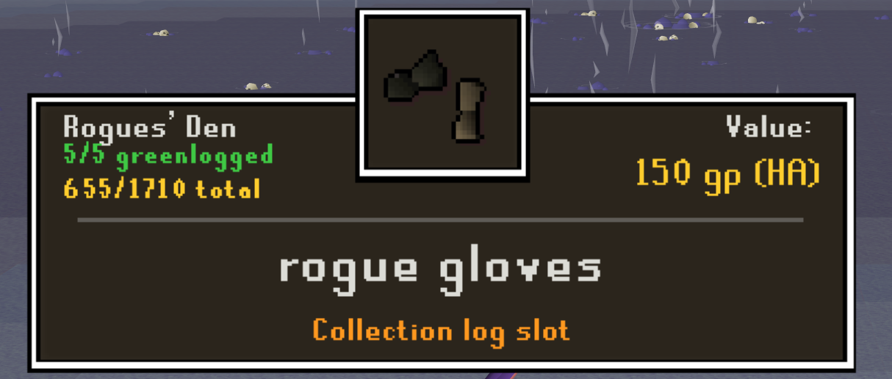
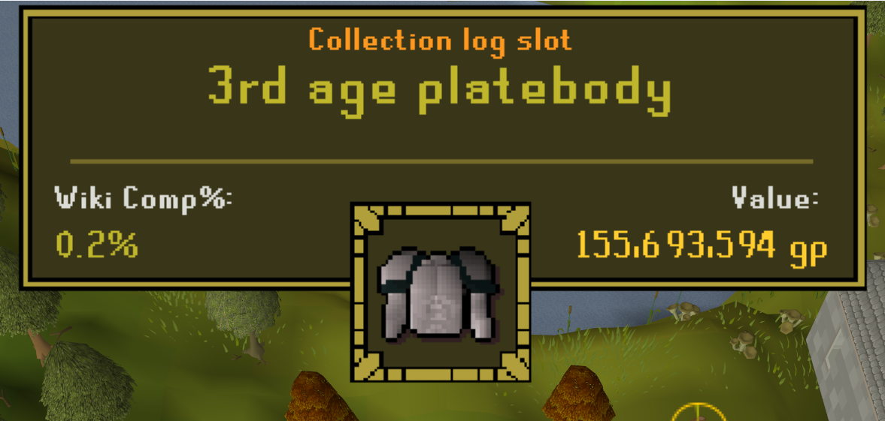
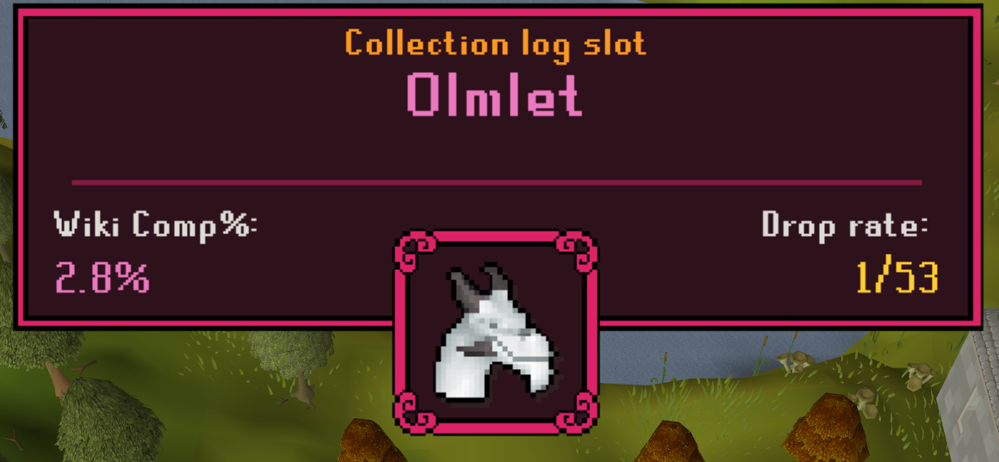
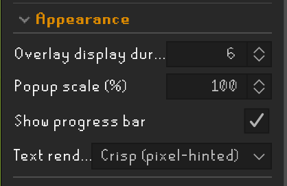

# Collection Log Popup Enhanced
Displays a popup and (optional) sound effect based on rarity on new collection logs.

# Setup
In settings menu, 
1. enable 'Collection log - New addition notification'
2. enable 'Collection log - New addition popup'

# Visuals

# Appearance
To test the plugin and set the scale of the popup select any tier in the 'preview popup' dropdown. This will show the popup as if you got a random item from that tier.
You can also scale the popup and set text-rendering to what looks good to you. Crisp text looks best at higher scale, smooth at lower.

Keep in mind that the popup might not cover the build-in popup on when set too small. (Build-in needs to be active if you wish screenshots to wait for the popup to be fully open)

# Popup
The popup will apear on gaining a new collection log slot, and show the icon for the item.
It also shows a different frame and sound effect based the completion rate of the item and the value (can be configured in settings to be either of the two or a combination)
At the top of the panel two values are displayed (configurable in setting). These values are:
- KC at which you got the item 
-- if no KC is available, it falls back to showing comp%
- Completion 
-- based on how many other players have this item (https://oldschool.runescape.wiki/w/Collection_log/Table)
- Drop rate
-- Shows drop rate of the item if available. Falls back to value if not.
- Value of the item
-- Based on G.E or High alch.

# Custom sounds
Want to use your own sound effects instead? Place any or all '.wav' files into '.runelite/collection-log-popup-enhanced/sounds/', using these exact filenames:
- `common.wav`
- `uncommon.wav`
- `rare.wav`
- `very_rare.wav`
- `pet.wav`
And it will use your sound instead! (See 'Appearance' on how to test if your audio works)
(Note: if it doesn't play a sound and the spelling is correct, your audio file is not supported, try another.)

# Thanks to:
C engineer plugin for collection log slot popup tie ins
Trailblazer audio effect for references to scripts on playing audio

The popup backgrounds are from:
https://bdragon1727.itch.io/custom-border-and-panels-menu-all-part
and customized by me in photoshop.

Sound effects:
Common: https://freesound.org/people/Kenneth_Cooney/sounds/609336/

Uncommon: https://freesound.org/people/PearceWilsonKing/sounds/238855/

Rare: https://freesound.org/people/jobro/sounds/198808/

Very rare: https://freesound.org/people/_MC5_/sounds/524848/

Pet: https://freesound.org/people/Tuudurt/sounds/275104/
