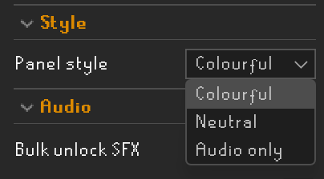
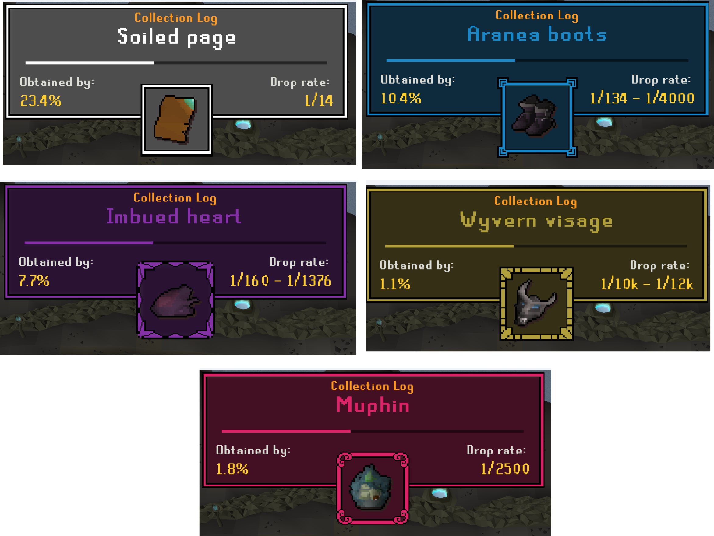
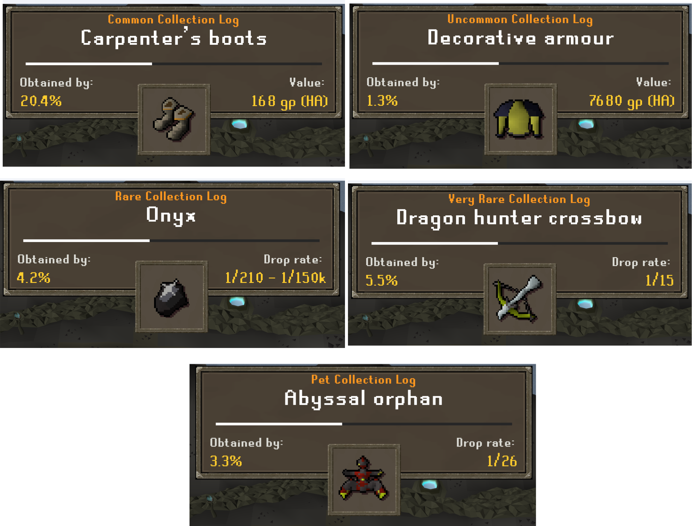
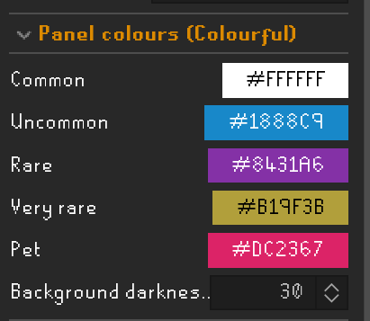
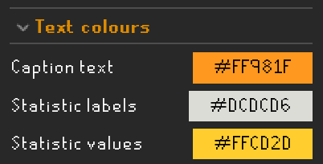
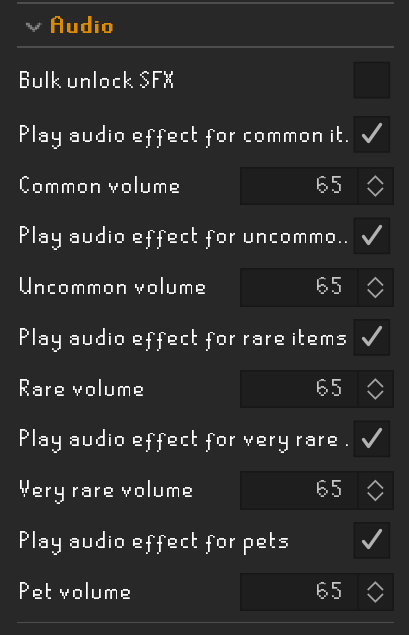
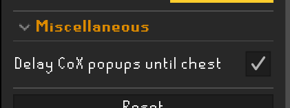

# Collection Log Popup Enhanced
Displays a popup and (optional) sound effect based on rarity on new collection logs.

- [Setup](#setup)
- [Visuals](#visuals)
  - [Colourful visuals](#colourful-visuals)
  - [Neutral visuals](#neutral-visuals)
  - [Audio only](#audio-only)
- [Testing](#testing)
- [Rarity tiers](#rarity-tiers)
- [Appearance](#appearance)
  - [Scaling](#scaling)
  - [Colors](#colors)
- [Statistics](#statistics)
- [Audio](#audio)
  - [Volume](#volume)
  - [Custom sounds](#custom-sounds)
- [Chambers of Xerics - Delay](#chambers-of-xerics---delay)
- [Native popups and screenshots](#native-popups-and-screenshots)
- [Thanks to:](#thanks-to)

# Setup
In settings menu, enable:
1. 'Collection log - New addition notification'
2. 'Collection log - New addition popup'

At the bottom of the page is an explaination of why the native popup has to be active even though we use our own popup.

# Visuals
You can choose between two visual styles, or audio only.

## Colourful visuals

## Neutral visuals

## Audio only
Plays a unique sound per tier, but shows the build-in collection log popup (or only audi if you disable popup in osrs settings)

# Testing
To test the popup without having to unlock a new collection log, select any tier (or random) in the 'preview popup' dropdown. This will show the popup as if you got an item from that tier.

(Don't forget to turn it off again when you're done testing)

# Rarity tiers
The popup has 5 different rarity tiers:
* Common
* Uncommon
* Rare
* Very rare
* Pet

Each has a different popup style and color scheme. You can customize rarity tier cutoffs based on:
* value
* wiki% (https://oldschool.runescape.wiki/w/Collection_log/Table)
* combination of both

# Appearance

## Scaling
You can also scale the popup and set text-rendering to what looks good to you. Crisp text looks best at higher scale, smooth at lower.

The native popup is hidden for any clog unlocked so only the enhanced panel shows. (Combat achievements will still show with the default popup and are not hidden).

The center bar depicts your progress towards collecting all collection log items.

## Colors
You can customize the panel's colours here (Active only on colourful mode).

Text colours can be customized here. Applied to both colourful and neutral mode.

# Statistics
At the bottom left and right of the panel statistics are displayed (configurable in setting). These values can be:
* Kill count - KC at which you got the item - if no KC is available it will show completion instead
* Completion - based on how many other players have this item (https://oldschool.runescape.wiki/w/Collection_log/Table)
* Droprate - Shows drop rate of the item if available. If no droprate available it will show value instead.
* Value - G.E price (High alch when the item has no G.E price).

# Audio

## Volume
You can set volume or disable audio for each tier. 
When multiple collections are logged at the same time audio plays for each popup. Select bulk unlock SFX to play only the first audio effect.

## Custom sounds
Want to use your own sound effects instead? Place any or all '.wav' files into '.runelite/collection-log-popup-enhanced/sounds/', using these exact filenames:
- `common.wav`
- `uncommon.wav`
- `rare.wav`
- `very_rare.wav`
- `pet.wav`

And it will use your sound instead! (See 'Testing' on how to test if your audio works)
(Note: if it doesn't play a sound and the spelling is correct, your audio file is not supported, try another.)

# Chambers of Xerics - Delay
Toggle this setting in Config to show the popup upon opening the chest (Or the Storage unit outside) instead of the moment of completing a raid. Use in conjucture with [CoX special loot hider](https://runelite.net/plugin-hub/show/cox-special-loot-hider)

> [!CAUTION]
> Using this setting + the loot-hider-plugin, might break the automatically screenshotting of collection logs from Chambers of Xerics.

# Native popups and screenshots
The native popup (the default one in the official client) has to be active in runescape settings, as the build in screenshot tool (taking a screenshot upon getting a new collection log) actually waits for the panel to be fully open, but only when this toggle is active. 
Even though the toggle has to be active, the native popup is hidden by the plugin so only the enhanced popup is shown.
In 'Audio only' mode the native popup is left untouched, so screenshots capture it as normal.

# Thanks to:
C engineer plugin for collection log slot popup tie ins.
Trailblazer audio effect for references to scripts on playing audio

## Code inspirations
The popup backgrounds are from:
https://bdragon1727.itch.io/custom-border-and-panels-menu-all-part
and customized by me in photoshop.

## Sound effects

Common: https://freesound.org/people/Kenneth_Cooney/sounds/609336/

Uncommon: https://freesound.org/people/PearceWilsonKing/sounds/238855/

Rare: https://freesound.org/people/jobro/sounds/198808/

Very rare: https://freesound.org/people/_MC5_/sounds/524848/

Pet: https://freesound.org/people/Tuudurt/sounds/275104/
